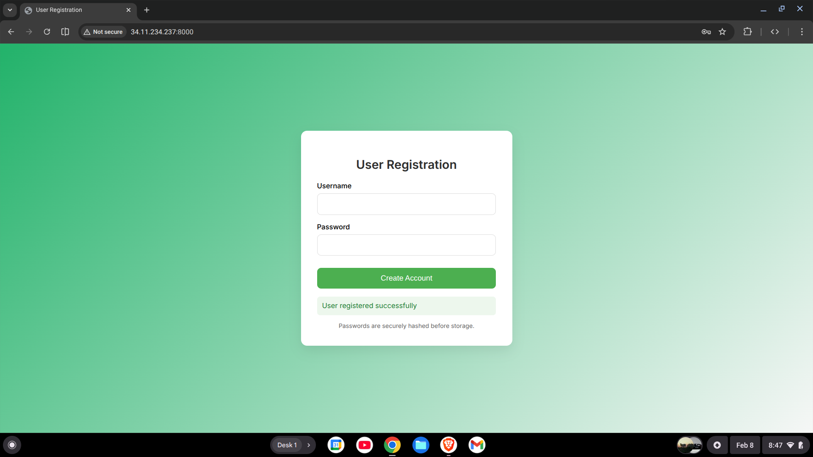

# User Registration App (FastAPI + GCP)

This project is a simple user registration system built using **FastAPI** and **Google Cloud Platform (GCP)**.

It serves a basic HTML form that collects a **username** and **password**, validates the input, securely hashes the password, and stores the user data in a **Google Cloud Storage (GCS) bucket**.

---

## Features

- FastAPI backend
- HTML + CSS + JavaScript frontend
- Username and password registration form
- Input validation (username length, password length)
- Duplicate username check
- Password hashing using **Argon2**
- User data stored in **Google Cloud Storage**
- Environment-based configuration

---

## Tech Stack

- **Backend**: FastAPI
- **Frontend**: HTML, CSS, JavaScript
- **Cloud**: Google Cloud Platform (Compute Engine, Cloud Storage)
- **Security**: Passlib (Argon2 hashing)
- **Environment Management**: python-dotenv

---

## Project Structure
 
main.py          # FastAPI backend
index.html       # Frontend registration form
.env             # Environment variables (not committed)
venv/            # Python virtual environment
README.md

---

## Prerequisites

- Google Cloud Platform account
- GCP VM instance or local machine
- Google Cloud Storage bucket
- Python 3.9+
- Google Cloud SDK installed and authenticated

---

## Environment Variables

Create a `.env` file in the project root:

The application will not start if bucket name is missing.

---

## Backend Setup

### Create and activate virtual environment

```jsx
python3 -m venv venv
source venv/bin/activate
```

### Install dependencies

```jsx
pip install fastapi uvicorn google-cloud-storage passlib[argon2] python-dotenv
```

### Authenticate with GCP

```jsx
gcloud auth application-default login
```

### Application Flow

1. User opens the homepage (/)
2. HTML form is served (index.html)
3. User enters:
    - Username (minimum 3 characters)
    - Password (minimum 6 characters)
4. Form submits data to /submit
5. Backend validates:
    - Username length
    - Password length
    - Username uniqueness in the bucket
6. Password is hashed using Argon2
7. User data is stored as JSON in GCS:
users/<username>.json
8. Success or error message is returned to the frontend

### Image


### API Endpoints

GET /

- Serves the registration HTML page

POST /submit

- Accepts form data:
    - username
    - password
- Performs validation and stores user data

### Validation Rules

- Username must be at least 3 characters
- Password must be at least 6 characters
- Username must be unique
- Passwords are never stored in plain text

### Security Notes

- Passwords are hashed using Argon2
- Environment variables are used for sensitive configuration
- Each user has a separate object in Cloud Storage

### Future Improvements

- Add authentication & login
- Use a database instead of object storage
- Add HTTPS and domain configuration
- Improve frontend UX
- Add rate limiting and CAPTCHA